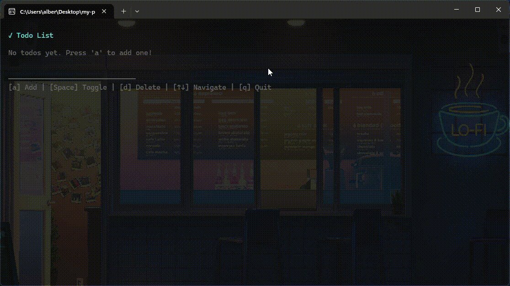

# Bun React TUI Todo App

Simple TUI Todo App built with **React** and **Ink**, bundled with Bun.



<div align="center">
  
  
  
  
</div>

## Installation

1. Clone the repository
    ```bash
    git clone https://github.com/AlbertArakelyan/bun-react-tui-todo.git
    ```

2. Start editing `todo.jsx`

3. Build `todo.jsx` into an executable with **Bun**
    ```bash
    bun build todo.jsx --compile --outfile todo.exe
    ```
    _Bun can build into an executable at once._

    Or into native Javascript - `dist/todo.js`
    ```bash
    bun build todo.jsx --outdir dist --target bun
    ```

    _Build scripts can be found in `package.json` as well._

4. Run with Bun
    ```bash
    bun todo.jsx
    ```
    _**Bun** can run `todo.jsx` straightaway without compiling into `todo.js` with **Vite**_. <br>
    You can run compiled **executable** straightway as well.

> [!NOTE]
> This is one advantages of **Bun** towards **Vite**.

### Node versions
- nodejs `v22.18.0`
- npm `v11.5.2`
- bun `v1.3.6`

## Used Libraries

### React

Interactive component based UI library for Javascript. <br>
https://react.dev

### Ink

Library which provides TUI components for React and can render `jsx` in the terminal via `render(<App />)`. <br>
https://github.com/vadimdemedes/ink

### ink-text-input

Text input component for **Ink**. <br>
https://github.com/vadimdemedes/ink-text-input

---

Feeling lucky? Give it a star ⭐ and fork for adding something from your side 😊.

This project was created using `bun init` in bun v1.3.6. [Bun](https://bun.com) is a fast all-in-one JavaScript runtime.
